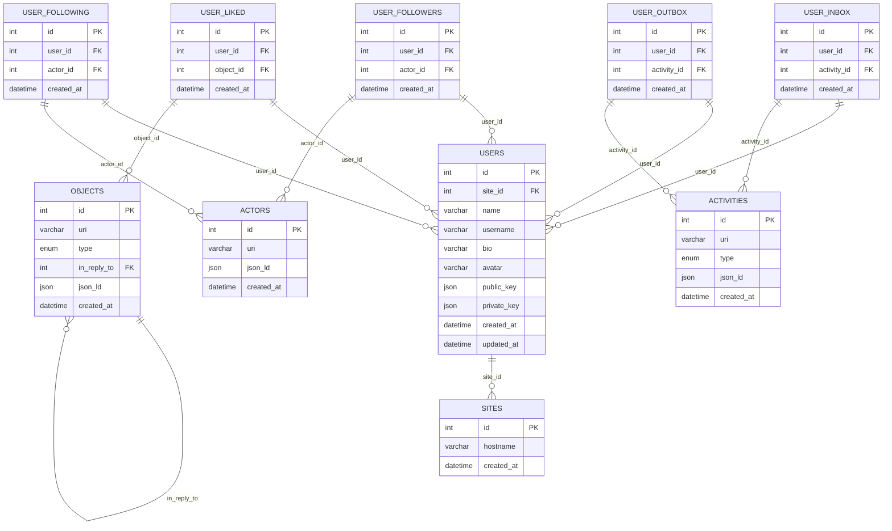

# Migrate from kv

Supporting code for migrating data from the `key_value` table to the new database
schema.

This should be short-lived, and will be removed once we have switched over fully
to the new database schema.

## Schema



- **`sites`** - Sites utilising the Ghost ActivityPub service  
- **`users`** - Users associated with a site
- **`actors`** - Fediverse actors
- **`objects`** - Fediverse objects
- **`activities`** - Fediverse activities
- **`user_inbox`** - Pivot table for users and the activities in their inbox
- **`user_outbox`** - Pivot table for users and the activities in their outbox
- **`user_liked`** - Pivot table for users and the objects they have liked
- **`user_followers`** - Pivot table for users and the actors that follow them
- **`user_following`** - Pivot table for users and the actors they follow

### Notes

- The `json_ld` fields are used to store the full JSON-LD document associated with
  a fediverse object, actor, activity etc. We store this in full as we don't always
  know what data is needed by the application. As and when we find we are accessing
  specific properties we can lift them out into their own fields in the database
  (i.e the `type` field in the `objects` table).

## Usage

### Setup the database and migrate existing data:

```bash
MYSQL_HOST=127.0.0.1 \
MYSQL_PORT=3306 \
MYSQL_USER=somebody \
MYSQL_PASSWORD=password \
MYSQL_DATABASE=activitypub \
node --import tsx src/migrate/migrate.ts
```

### Add new data to the database:

```js
import { handleKvSet } from 'migrate/lib/utils';

// ...

await handleKvSet(key, value, db);
```

`handleKvSet` should be called at the same point that we write to the KV store
with the same parameters, as well as the global `db` object. This function will
then parse the provided `key` and work out what table / row to write the data to
in the database.

## Example Queries

### Get all activities in a user's inbox

```sql
SELECT activities.* FROM user_inbox
INNER JOIN activities ON user_inbox.activity_id = activities.id
WHERE user_inbox.user_id = <user_id>;
```

### Get all `create` and `announce` activities in a user's inbox

```sql
SELECT activities.* FROM user_inbox
INNER JOIN activities ON user_inbox.activity_id = activities.id
WHERE user_inbox.user_id = <user_id> AND activities.type IN ('create', 'announce');
```

### Get all followers of a user

```sql
SELECT actors.* FROM user_followers
INNER JOIN actors ON user_followers.actor_id = actors.id
WHERE user_followers.user_id = <user_id>;
```

### Check if a user is following an actor

```sql
SELECT EXISTS (
    SELECT 1 FROM user_following
    INNER JOIN actors ON user_following.actor_id = actors.id
    WHERE user_following.user_id = <user_id> AND actors.uri = <actor_uri>
) AS is_following;
```
